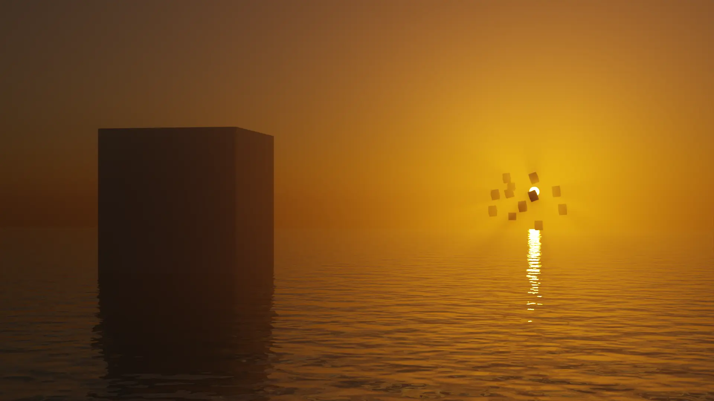

# Ray Tracing in C++

One of the first scenes (and probably the simplest) that I created in Blender was a submerged cube, somewhere at sea, around sunset. The core focus was volumetric lighting. I can say it turned out pretty well.



Now, the goal of this project is simple: recreate that scene from scratch. No Blender. No abstractions. From the ground up using OpenGL and C++.

Here's all the stuff I'd like to explore:
- Global illumination via Monte Carlo path tracing
- Physically-based material models (metallic, water, matte)
- Volumetric light scattering for atmospheric god rays
- Edge-aware denoising to reduce noise while preserving details
- Interactive controls to adjust lighting in real-time

## Setup

Clone the repository and install ImGui:

```bash
cd src/vendor/
git clone https://github.com/ocornut/imgui.git
```

GLAD and stb_image_write are already included. Build with Make.

